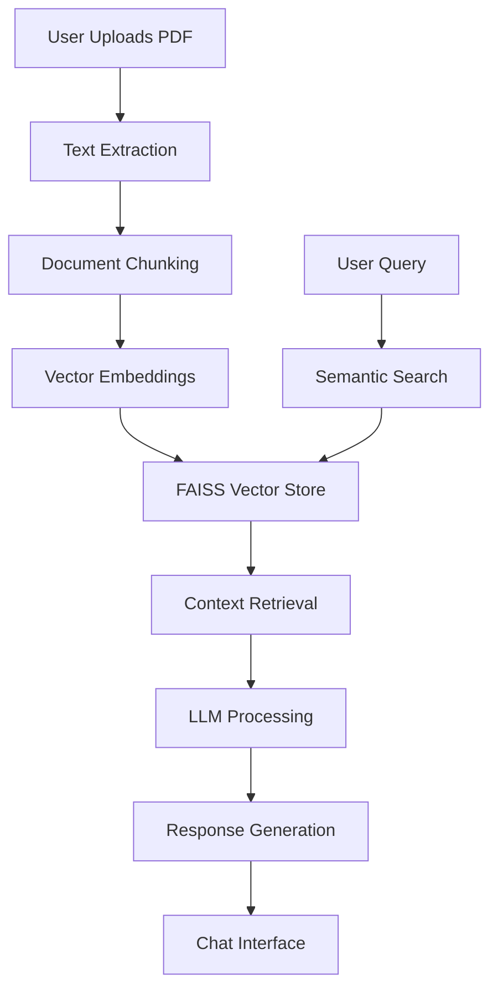

# 🧠 DocuMind

<div align="center">

**AI-Powered Document Intelligence & Conversational RAG System**

[](https://python.org)
[](https://fastapi.tiangolo.com)
[](https://reactjs.org)
[](https://openai.com)
[](LICENSE)

*Transform static PDFs into intelligent, conversational knowledge assistants*

[🚀 Live Demo](#) • [📖 Documentation](#) • [🐛 Report Bug](#) • [✨ Request Feature](#)

</div>

---

## 🎯 What is DocuMind?

DocuMind is an advanced **AI Document Search and Conversational Retrieval System (RAG Chatbot)** that revolutionizes how you interact with PDF documents. Simply upload your PDFs and start having natural conversations with your documents to extract insights, find answers, and discover knowledge instantly.

### ✨ Key Features

- 🤖 **Conversational AI**: Chat with your documents using natural language
- 🔍 **Semantic Search**: Find relevant information using AI-powered vector search
- 📄 **PDF Intelligence**: Extract and understand complex document structures
- 💬 **Context-Aware**: Maintains conversation history for better responses
- ⚡ **Real-time**: Instant answers with typing indicators and smooth UX
- 🔒 **Privacy-First**: Local processing with optional cloud integration
## 🚀 Quick Start

### Prerequisites

- Python 3.8+
- Node.js 16+
- OpenAI API Key

### Installation

```bash
# Clone the repository
git clone https://github.com/yourusername/documind.git
cd documind

# Backend setup
cd backend
pip install -r requirements.txt

# Frontend setup
cd ../frontend
npm install

# Set up environment variables
cp .env.example .env
# Add your OpenAI API key to .env
```

### Running the Application

```bash
# Start backend (from backend directory)
uvicorn main:app --reload

# Start frontend (from frontend directory)
npm start
```

## 🏗️ Architecture

### System Overview



### Core Components

| Component | Technology | Purpose |
|-----------|------------|---------|
| **Frontend** | React + Tailwind CSS | Modern chat UI, file upload, real-time interaction |
| **Backend** | FastAPI (Python) | REST APIs, request handling, orchestration |
| **AI Engine** | OpenAI API + LangChain | Embeddings, RAG pipeline, conversational AI |
| **Vector DB** | FAISS (Local) | High-speed semantic search |
| **Storage** | Local Filesystem | PDF and metadata storage |

## 🧩 Core Functionalities

### 🔹 Intelligent PDF Management
- Upload, manage, and store multiple PDF documents
- Text extraction and preprocessing using LangChain's document loaders
- Smart chunking of content for better retrieval accuracy

### 🔹 Semantic Search & RAG
- OpenAI Embeddings API for semantic vector representations
- FAISS for high-speed local similarity search
- Context-aware answer generation using retrieved content

### 🔹 Conversational AI Layer
- Built on LangChain's ConversationalRetrievalChain
- Maintains conversational context across queries
- Supports multi-document Q&A and long-context reasoning

### 🔹 Interactive Frontend
- Modern, responsive UI with React + Tailwind CSS
- Real-time chat interface with typing indicators
- Seamless file upload integration

### 🔹 Scalable Backend
- FastAPI backend with modular architecture
- REST APIs for document upload, embedding generation, and query retrieval
- Clean code organization with separate modules
## 🛠️ Technical Stack

| Layer | Technology | Purpose |
|-------|------------|---------|
| **Frontend** | React, Tailwind CSS | Modern chat UI, PDF upload, interactive visualization |
| **Backend** | FastAPI (Python) | API endpoints, request handling, orchestration |
| **AI/LLM** | OpenAI API, LangChain | Embeddings, prompt engineering, conversational chain |
| **Vector DB** | FAISS (Local) / Pinecone (Future) | Semantic vector search |
| **Storage** | Local (Current) / Firebase (Future) | PDF and metadata storage |
| **Deployment** | Docker + Vercel | CI/CD ready, production deployment |

## 🔄 How It Works

### Workflow Process

1. **📄 Document Upload**: User uploads PDF via web interface
2. **🔍 Text Extraction**: Backend extracts and preprocesses text using LangChain
3. **✂️ Smart Chunking**: Document text is intelligently segmented
4. **🧠 Vectorization**: Text chunks converted to embeddings via OpenAI API
5. **💾 Storage**: Embeddings stored in FAISS for semantic retrieval
6. **❓ Query Processing**: User asks questions through chat interface
7. **🔎 Retrieval**: System finds most relevant chunks using semantic search
8. **🤖 Generation**: LLM combines context with user query for accurate responses
9. **💬 Response**: Context-aware answer returned to frontend chat

### Architecture Layers

- **📊 Data Layer**: PDF ingestion, extraction, chunking, and embeddings
- **💾 Storage Layer**: FAISS Vector DB, metadata persistence
- **🧠 AI Layer**: Retrieval-Augmented Generation (RAG) using OpenAI models
- **🎨 Presentation Layer**: Chat-driven frontend for conversational interaction
## 🚀 Future Enhancements

### 🔒 Security & Access Control
- User authentication and role-based access control
- Secure login and personalized document management
- Multi-tenant support for enterprise deployments

### ☁️ Scalability Improvements
- Cloud VectorDB integration (Pinecone, Weaviate)
- Distributed search capabilities
- Auto-scaling infrastructure

### 📊 Analytics & Insights
- Dashboard analytics for document usage
- Query frequency and retrieval accuracy metrics
- Performance monitoring and optimization

### 🧩 Extended Format Support
- Multi-format support (DOCX, TXT, web pages)
- Image and table extraction capabilities
- Batch document processing

### 🔉 Advanced Features
- Voice interface integration
- Multi-language support
- API rate limiting and caching

## 🤝 Contributing

We welcome contributions! Please see our [Contributing Guidelines](CONTRIBUTING.md) for details.

### Development Setup

```bash
# Fork and clone the repository
git clone https://github.com/yourusername/documind.git

# Create a virtual environment
python -m venv venv
source venv/bin/activate  # On Windows: venv\Scripts\activate

# Install dependencies
pip install -r requirements.txt
npm install

# Run tests
pytest
npm test
```

## 📄 License

This project is licensed under the MIT License - see the [LICENSE](LICENSE) file for details.

## 🙏 Acknowledgments

- [OpenAI](https://openai.com) for the powerful GPT models
- [LangChain](https://langchain.com) for the RAG framework
- [FAISS](https://faiss.ai) for vector similarity search
- [FastAPI](https://fastapi.tiangolo.com) for the robust backend framework

## 💡 Vision Statement

> **To revolutionize how humans interact with knowledge**

DocuMind transforms static, text-heavy documents into living knowledge assistants, bridging the gap between data and understanding. Our goal is to empower individuals and enterprises with intelligent document comprehension, drastically reducing the time spent searching and reading while improving productivity and decision-making.

---

<div align="center">

**⭐ Star this repository if you found it helpful!**

[](https://github.com/8090vikas/documind)
[](https://github.com/yourusername/8090vikas/fork)

Made with ❤️ by [Your Name](https://github.com/8090vikas)

</div>
